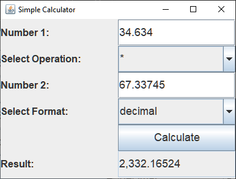

# Calculator
Simple calculator program made in Java.
Project was made to learn about Java Reflection, I make a calculator with a specified formatter. These formatters will change how the result of the calculation is displayed. In order to choose the formatter a config file is read that tells the program what formatter is needed. The config contains the exact class name of the formatter, this is passed to the factory where this class is made and injected into the calculator.

Example output formats:
- 1234,56789
- $ 1,234.57
- € 1.234,57
- 1,23456789 E3

A simple swing GUI is provided:  

